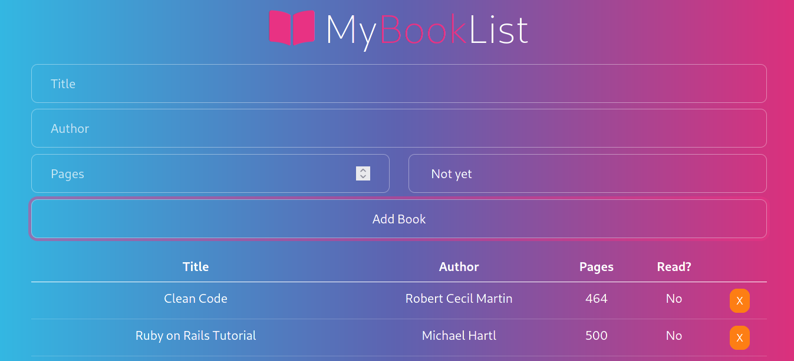

# Library App

> We all like reading books, right? 
> Awesome! this is a simple library app where users can add and delete books and keep track of the reading status.

## Built With

- HTML5
- Bootstrap
- JavaScript

## Live Demo

[Live Demo Link](https://ixboy.github.io/Library/)

## Getting Started

Run it locally by following the steps bellow...

### Setup and Install

- Clone this repository using the link above (click on the 'code' button)
- Open a terminal and `cd` to the cloned repository
- Open your code editor and use the live server to view it in your preferred browser

### Usage

- Click on 'Add Book' to add a book
- Click on 'X' to delete a book

### Deployment

- Deployed on GitHub Pages

## Author

👤 **Iyunda Ismael Antonio**

- GitHub: [@ixboy](https://github.com/ixboy)
- Twitter: [@ismaelixboy](https://twitter.com/ismaelixboy)
- LinkedIn: [ismael-antonio](https://www.linkedin.com/in/ismaelantonio/)

## 🤝 Contributing

Contributions, issues, and feature requests are welcome!

Feel free to check the [issues page](https://github.com/ixboy/Library/issues).

## Show your support

Give a ⭐️ if you like this project!

## Acknowledgments

- [The Odin Project](https://www.theodinproject.com/paths/full-stack-ruby-on-rails/courses/javascript/lessons/library)

## 📝 License

This project is [MIT](LICENSE) licensed.
